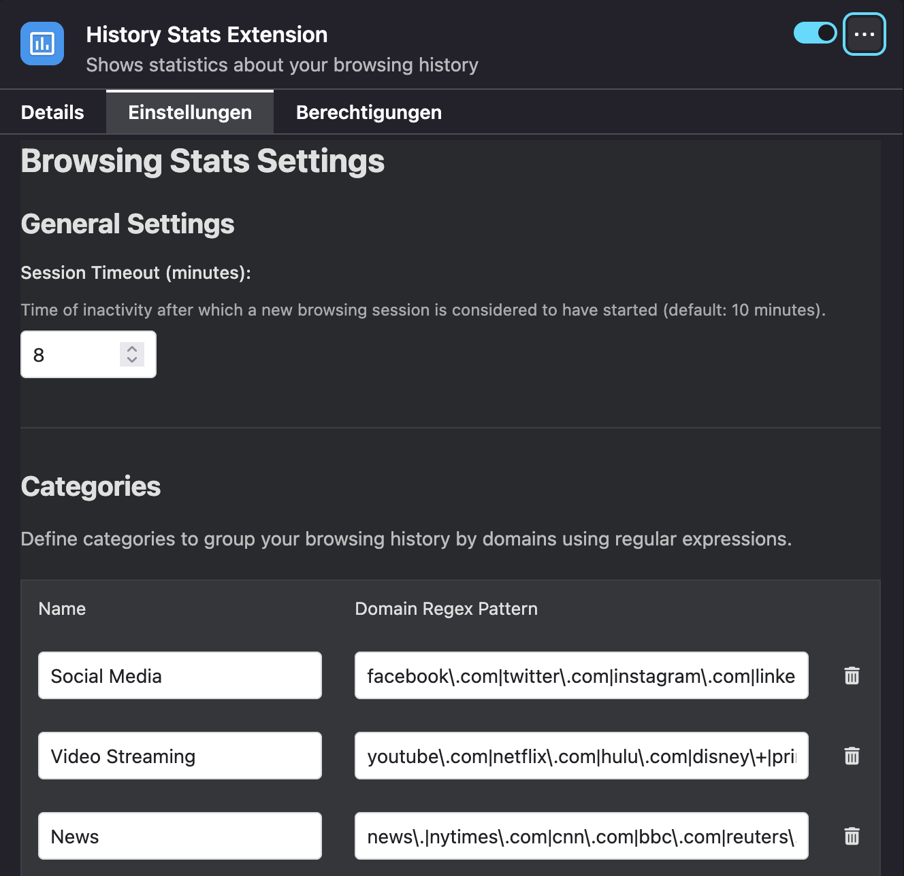

# BrowsingTime Firefox Extension


A Firefox extension that provides statistics and insights about your browsing history.

<br>
Popup

<br>
Extension

<br>
Plugin Settings

## Table of Contents
- [Features](#features)
- [Installation](#installation)
- [Usage](#usage)
- [How It Works](#how-it-works)
- [Development](#development)
- [Contributing](#contributing)
- [License](#license)
- [Acknowledgments](#acknowledgments)
- [Contact](#contact)
- [Roadmap](#roadmap)

## Features

- View detailed statistics about your browsing history
- Analyze browsing patterns by time of day and categories
- Track website usage across different domains
- Categorize websites using customizable domain patterns
- Filter statistics by date and category
- Dark mode support for comfortable viewing
- Privacy-focused: all data processing happens locally in your browser
- Simple and intuitive user interface

## Installation

### Developer Installation

1. Open Firefox and navigate to `about:debugging`
2. Click on "This Firefox" in the left sidebar
3. Click on "Load Temporary Add-on"
4. Navigate to this directory and select the `manifest.json` file

### Production Installation

Once the extension is published to the Firefox Add-ons store, you can install it directly from:
[Firefox Add-ons Store Link - Coming Soon]()

## Usage

1. Click on the BrowsingTime icon in your browser toolbar
2. The popup will display statistics about your browsing history
3. Use the category filter to view statistics for specific website categories
4. Click on "Open Extended View" for more detailed visualizations
5. Access settings to customize category definitions and other preferences

## How It Works

BrowsingTime accesses your browser history data (with your permission) and processes it locally in your browser. The extension:

1. Retrieves history entries from the browser's history API
2. Categorizes websites based on domain patterns you define
3. Analyzes usage patterns by time, domain, and category
4. Presents the data through intuitive charts and statistics

No data is sent to external servers - all processing happens on your device.

## Development

The extension has the following structure:
```
browsing-time/
├── manifest.json       # Extension configuration
├── background.js       # Background script
├── libs/               # Third-party libraries
├── shared/             # Shared resources
├── popup/              # Browser action popup
├── extension-page/     # Extended statistics view
├── settings/           # Settings page
└── icons/              # Extension icons
```

### Setup Development Environment

1. Clone this repository
```
git clone https://github.com/rolandortner/browsing-time.git
cd browsing-time
```

2. Make your changes to the code
3. Load the extension in Firefox as described in the Installation section

### Building for Production

To package the extension for submission to the Firefox Add-ons store:

1. Ensure all files are properly formatted and tested
2. Create a ZIP file containing all necessary files
3. Submit the ZIP file to the [Firefox Add-ons Developer Hub](https://addons.mozilla.org/developers/)

## Contributing

Contributions are welcome! Please feel free to submit a Pull Request.

1. Fork the repository
2. Create your feature branch (`git checkout -b feature/amazing-feature`)
3. Commit your changes (`git commit -m 'Add some amazing feature'`)
4. Push to the branch (`git push origin feature/amazing-feature`)
5. Open a Pull Request

## License

This project is licensed under the MIT License - see the [LICENSE](LICENSE) file for details.

## Acknowledgments

- This project was developed with the assistance of AI tools, specifically Cursor and Windsurf (with Claude)
- Mozilla for their excellent WebExtensions API documentation
- The open-source community for inspiration and resources
- Chart.js for the visualization library

## Contact

Project Link: [https://github.com/rolandortner/browsing-time](https://github.com/rolandortner/browsing-time)

## Roadmap

- Add more detailed statistics and visualizations focusing on the active time
- Refactor the JS and CSS files and clean up the code (remove duplicates)
- Implement export functionality for history data
- Add custom time period selection for more flexible analysis
- Improve categorization with machine learning suggestions
- Develop additional visualization types for different insights
- Add browser action badge with daily stats summary
- Support for additional browsers (Chrome, Edge)